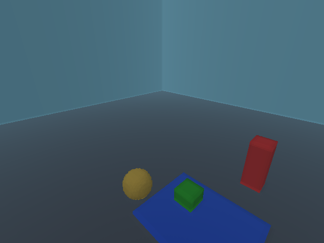

# roxlap

A pure-Rust port of [Ken Silverman's Voxlap](http://advsys.net/ken/voxlap.htm)
voxel engine — a CPU-rendered 3D voxel renderer from the Build-engine era.
Runs on Linux / macOS / Windows from one Cargo workspace, no GPU required,
no C dependency, idiomatic safe Rust with per-architecture SIMD.



## What is Voxlap?

Voxlap is the voxel rendering engine [Ken Silverman](http://advsys.net/ken/)
wrote in the early 2000s, after the Build engine that powered *Duke Nukem
3D*. It draws volumetric voxel terrain plus animated kv6 sprites entirely
on the CPU, using Ken's classic "raycast columns + scanline fill"
algorithm — no GPU, no shaders. Cult-favourite games like
[Voxelstein 3D](https://en.wikipedia.org/wiki/Voxelstein_3D),
[Ace of Spades](https://en.wikipedia.org/wiki/Ace_of_Spades_\(video_game\)),
and Ken's own *Slab6* / *Voxed* shipped on top of it.

roxlap is that engine, reimplemented from scratch in Rust. It reads the
same `.vxl` (worlds) / `.kv6` / `.kvx` (sprite voxels) / `.kfa` (sprite
animation rigs) files Ken's engine reads, renders them with the same
algorithms, and is **bit-exact** against the reference C engine
([voxlaptest](https://github.com/NCrashed/voxlaptest)) on every test
pose where the underlying SIMD allows.

## Quick start

Try the procedural-cave demo — generates a Worley + Perlin cave
network on startup, lets you fly through it, fire plasma bullets that
carve the world in real time, and toggle between two visual presets
matching Ken's reference screenshots:

```sh
git clone https://github.com/NCrashed/roxlap
cd roxlap
cargo run --release -p roxlap-cave-demo
```

A window opens (~1-2 s startup for cave gen). Click in the window to
grab the cursor; WASD + mouse-look to fly with collision-checked
movement; `Space` / `LShift` for vertical; `LCtrl` for fast-fly;
**LMB to fire a plasma bullet** that carves a crater on impact;
`F` to toggle blue ↔ magenta cave preset (regenerates); `R` for a
new seed; `Esc` to release the cursor or exit.

For the engine-only demo (full-feature voxel world with kv6 sprites
and panoramic sky, no cave-gen / editing):

```sh
cargo run --release -p roxlap-host
```

`L` toggles baked world-voxel lighting; `F` writes
`roxlap-capture.{txt,ppm}` for off-line repro of render artifacts.

For the **browser demos** — same engine, wasm32 + WebAssembly SIMD,
running on a `<canvas>`:

```sh
# Engine demo (oracle world, ~360 KB wasm + 18 KB JS)
cd crates/roxlap-web
trunk serve         # opens http://localhost:8080

# Cave demo (procedural Worley + Perlin caves with bullets +
# carving + local relight, ~130 KB wasm)
cd crates/roxlap-cave-web
trunk serve
```

Both use WASD / arrows + click-to-mouse-look + Space / Shift for
vertical. The cave demo adds Ctrl for fast-fly, click-while-locked
to fire bullets, F to toggle blue ↔ mag preset, R for next seed.
The engine demo's `B` runs an in-browser 300-frame bench (results
in the devtools console). Mobile: drag the canvas's left half as
a virtual joystick, right half to look around (cave demo: tap to
fire). Both demos use `wasm-bindgen-rayon` to fan rayon's render
parallelism (per-strip, per-light-row, per-sprite) across Web
Workers, so a 4-core phone gets ~3× the frame rate of a single-
threaded build. `trunk build --release` produces a static `dist/`
that needs **cross-origin-isolation headers**
(`Cross-Origin-Opener-Policy: same-origin` +
`Cross-Origin-Embedder-Policy: require-corp`) on the host —
without them, `SharedArrayBuffer` is disabled and the thread pool
won't spin up. Full setup + per-host header config in
[crates/roxlap-web/README.md](crates/roxlap-web/README.md).

## Crates

| Crate | Purpose |
|-------|---------|
| [`roxlap-core`](crates/roxlap-core) | The engine: framebuffer, camera, opticast raycaster, grouscan rasterizer, sprite + sky + voxel-lighting. |
| [`roxlap-formats`](crates/roxlap-formats) | On-disk file format parsers (`.vxl`, `.kv6`, `.kvx`, `.kfa`) **plus the voxel-edit module** — `delslab` / `insslab` / `ScumCtx` plus high-level `set_spans` / `set_cube` / `set_sphere` / `set_rect` (with bit-exact byte equivalence to voxlap C's `setspans` validated against captured fixtures). No renderer dependency; useful standalone for level editors, asset converters, and procedural-world tools. |
| [`roxlap-cavegen`](crates/roxlap-cavegen) | Procedural cave generation. Worley-distance shape classification + Perlin overlay, two visual presets (`BlueCaveGenerator`, `MagCaveGenerator`) matching Ken + Tom Dobrowolski's 2003 *Justfly* demo screenshots, and a `pack_dense_grid_to_vxl` helper that folds a dense voxel mask + colour grid into voxlap's slab format. Pure-Rust (no `cmake` / C++ build deps). |
| [`roxlap-cave-demo`](crates/roxlap-cave-demo) | Procedural-cave showcase binary (winit + softbuffer). Cave-gen on startup, real-time edits via plasma bullets, fog, F/R preset+seed toggles. |
| [`roxlap-host`](crates/roxlap-host) | Engine-feature demo binary (kv6 sprites + KFA animation + panoramic sky on the bundled oracle world). |
| [`roxlap-web`](crates/roxlap-web) | Engine demo for the browser (wasm32 + wasm-bindgen + canvas). Oracle world + WebAssembly SIMD batches, ~360 KB wasm bundle. Run via `trunk serve` for dev / `trunk build --release` for deploy. |
| [`roxlap-cave-web`](crates/roxlap-cave-web) | Cave demo for the browser — Worley + Perlin cave-gen, fly + fire + carve with local relight on impact, all on wasm32. ~130 KB wasm bundle (no embedded asset; cave is generated client-side). |
| [`roxlap-oracle`](crates/roxlap-oracle) | Cross-engine render-hash oracle: renders 12 fixed test poses, FNV-1a-hashes each framebuffer, diffs against voxlaptest's C goldens. CI gates on this. |

The library API surface is documented at [docs.rs/roxlap-core](https://docs.rs/roxlap-core)
and [docs.rs/roxlap-formats](https://docs.rs/roxlap-formats).

## Why roxlap?

- **Cross-platform from one source.** Linux, Windows, macOS (x86_64 +
  arm64), wasm — all from one Cargo workspace. No `#ifdef _MSC_VER`,
  no MASM, no C FFI.
- **SIMD per architecture.** SSE2 on x86_64, NEON on aarch64,
  WebAssembly simd128 (`f32x4_*`) on wasm32 — all via
  `core::arch::*` intrinsics. A portable scalar fallback exists as
  the correctness reference, and per-arch goldens pin each path's
  output bit-for-bit (rsqrt-approximation precision differs across
  arches by design).
- **Idiomatic safe Rust public API.** RAII handles, `Result` at every
  external boundary, no globals leaked across an FFI seam because there
  is no FFI.
- **Bit-exact correctness against voxlaptest** where the SIMD approach
  matches; image-similarity correctness everywhere else, with frozen
  per-pose hashes pinning known sub-pixel rounding noise so any
  *unintentional* drift fails CI immediately.
- **Real-time voxel editing.** Carve / fill spans, cubes, rectangles,
  and spheres at runtime via `roxlap_formats::edit::*`. The same edit
  pipeline drives the cave demo's bullet impacts and is byte-equality
  validated against voxlap C's `setspans`. Closure-based colour
  callbacks let you implement any of voxlap's `vx5.colfunc` patterns
  (constant, jittered, position-dependent, texture-mapped) without
  the global-state dance the original engine required.

## Status

The renderer is feature-complete: voxel terrain (`opticast` + `grouscan`),
animated kv6 sprites, world-voxel lighting, textured panoramic sky,
x86_64 SSE2 batches. The cross-engine oracle tracks 9 of 12 voxlap C
poses — 5 byte-for-byte bit-exact with the C reference, 4 frozen as
roxlap's own goldens after visual verification (sub-pixel rounding
noise from `_mm_rcp_ps`-based vertex projection is documented in
[PORTING-RUST.md](PORTING-RUST.md)).

```text
$ cargo run --release -p roxlap-oracle -- diff
MATCH    north  326a7c41c3cc659d
MATCH    east  3e00f1d0d62d5be0
MATCH    diag_down  118de3c1132d0f6b
MATCH    high_down  cd1ceac6e21c55f4
MATCH    sprite_above  c92ebd054aa7c12e        (roxlap-frozen)
MATCH    sprite_front  87c7de0ddeb0f7ce        (roxlap-frozen)
MATCH    sprite_iso  9caf71069594fde6          (roxlap-frozen)
MATCH    sprite_coco  bf0f4329b473c69e         (roxlap-frozen)
MATCH    diag_down_lit  b536ce3fdf771b9e       (roxlap-frozen)
9 match, 0 mismatch, 0 missing-from-golden (9 total roxlap rows)
```

ARM NEON (R9) and wasm SIMD + browser host (R10) landed. Open
work: crates.io publish (R11.9). See
[PORTING-RUST.md](PORTING-RUST.md) for the full substage roadmap.

## Multicore

Three parallelism axes ship out of the box, all rayon-backed:

```rust
// 1. Per-strip render — split the framebuffer into N row strips,
//    each runs an independent opticast pass. Pool size = strip count.
let mut pool = ScratchPool::new_parallel(xres, yres, vsid, 4);

// 2. World-voxel lighting bake — outer y-loop is rayon::par_iter.
//    Honours RAYON_NUM_THREADS env var.
roxlap_core::update_lighting(world, offsets, vsid, x0, y0, z0, x1, y1, z1, mode, &lights);

// 3. Sprite batch — par_iter over &[Sprite], z-test arbitrates writes.
let target = DrawTarget::new(fb, zb, pitch, w, h);
draw_sprites_parallel(target, &cam_state, &settings, &lighting, &sprites);
```

Measured on Intel i7-12700H (6 P-cores + 8 E-cores, 24 MB L3):

| workload | sequential | parallel (best) | speedup | RAYON_NUM_THREADS |
|---|---|---|---|---|
| opticast per-strip render (oracle, 12 poses, 640×480) | 10.98 ms | 7.36 ms | **1.49×** | 4 |
| update_lighting (448×448×200 bake) | 38.11 ms | 11.38 ms | **3.35×** | default (20) |
| draw_sprites (64 sprites, synthetic grid) | 1.19 ms | 0.27 ms | **4.42×** | 16 |
| draw_sprites (256 sprites) | 2.48 ms | 0.42 ms | **6.13×** | default (20) |

The opticast hot path has limited parallelism headroom (per-strip
ray fans discretise differently per N — geometrically valid but
not byte-stable across strip counts; CI freezes goldens at N=1).
update_lighting and the sprite batch scale near-linearly past 8
threads — they're the right axes for dynamic-light or
massive-sprite scenes.

Bench commands:

```sh
roxlap-oracle bench --threads N         # opticast scaling
roxlap-oracle bench-lighting            # update_lighting scaling (RAYON_NUM_THREADS env)
roxlap-oracle bench-sprites --sprites N # sprite scaling (RAYON_NUM_THREADS env)
```

Full design + tradeoffs in
[PORTING-MULTICORE.md](PORTING-MULTICORE.md).

## Documentation

- API: [docs.rs/roxlap-core](https://docs.rs/roxlap-core),
  [docs.rs/roxlap-formats](https://docs.rs/roxlap-formats).
- Algorithm + porting notes: [PORTING-RUST.md](PORTING-RUST.md).
- Reference C engine this ports from:
  [voxlaptest](https://github.com/NCrashed/voxlaptest).
- Original Voxlap homepage: [advsys.net/ken/voxlap.htm](http://advsys.net/ken/voxlap.htm).

## Contributing

After cloning, point git at the tracked hooks:

```sh
git config core.hooksPath .githooks
```

Installed:
- **`pre-commit`** — `cargo fmt --check` across the workspace, with
  unstaged changes stashed for the check so it never fails on
  something you didn't stage. Bypass with `git commit --no-verify`.
- **`commit-msg`** — strips trailing whitespace from every commit
  message line.

Clippy is **not** in the pre-commit hook — pedantic lints are
opinionated enough that a >2-second pre-commit hook would just get
`--no-verify`'d. Run `cargo clippy --all-targets -- -D warnings`
manually before pushing if you want the same gate locally; CI
enforces it on every push regardless
([.github/workflows/ci.yml](.github/workflows/ci.yml)).

## License

Dual-licensed under either of:

- Apache License, Version 2.0 ([LICENSE-APACHE](LICENSE-APACHE))
- MIT license ([LICENSE-MIT](LICENSE-MIT))

at your option.

The Voxlap engine algorithms and on-disk data formats this crate
implements were originally created by Ken Silverman. Voxlap's
original C source is distributed under separate terms: royalty-free
for non-commercial use; commercial use requires a license from Ken
Silverman directly. roxlap is an independent Rust port that does not
contain Ken's original C source, but its observable behaviour mirrors
his engine's. If you intend to use roxlap or any derived work
commercially, contact Ken Silverman about Voxlap commercial
licensing — see [advsys.net/ken](http://advsys.net/ken/) for
current contact information.
